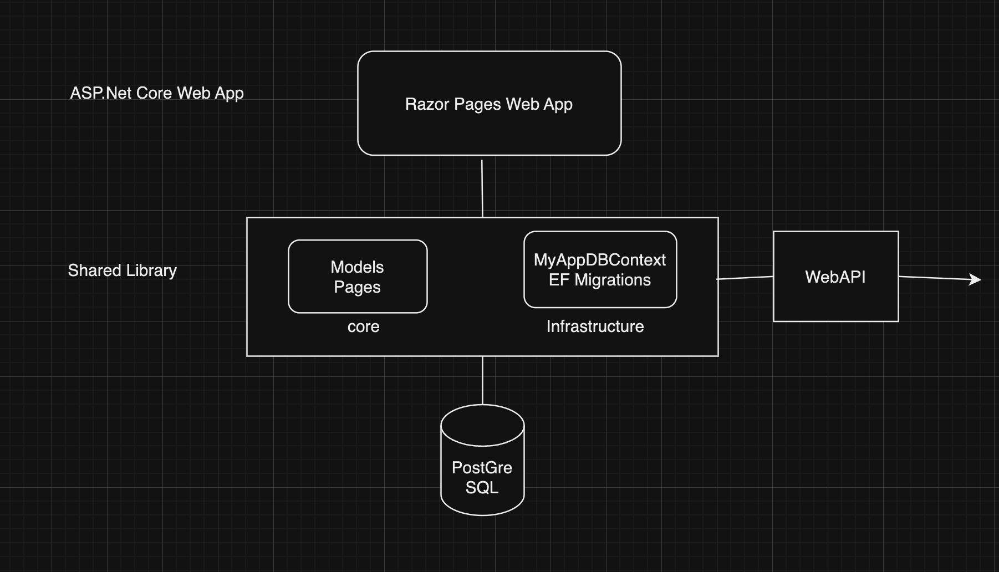

# MassPersona Media Review Application

Welcome to MassPersona Media Review, a web application that allows users to create, edit, view, and delete media reviews. Built with HTML, CSS, Bootstrap, ASP.NET Core Razor Pages and PostgreSQL, this full stack application offers a user-friendly interface for managing content effectively.

---

## Table of Contents

- [Introduction](#introduction)
- [Prerequisites](#prerequisites)
- [Installation Instructions](#installation-instructions)
- [Running the Application](#running-the-application)
- [Application Architecture](#application-architecture)
- [Design Decisions](#design-decisions)
- [Assumptions and Considerations](#assumptions-and-considerations)

---

## Introduction

The **MassPersona Media Review** application is a web-based platform that allows users to create, edit, view, and delete reviews for various media types such as movies, TV shows, games, books, and music. The application incorporates features like pagination, sorting, filtering, and user feedback through alert messages.

---

## Prerequisites

Before setting up the application, ensure that you have the following installed on your system:

- [.NET 6.0 SDK](https://dotnet.microsoft.com/download/dotnet/6.0)
- [Git](https://git-scm.com/downloads)
- [PostGreSQL](https://www.postgresql.org/download/)
- **For macOS: ( visual studio is not compatible with macOs anymore)** 
  - [Visual Studio Code](https://code.visualstudio.com/download)
  - Make sure to add C# in the extensions section of visual studio code
- **For Windows:**
  - [Visual Studio 2022](https://visualstudio.microsoft.com/downloads/) (Community Edition is sufficient)


---

## Installation Instructions

### Cloning the Repository

To get started, clone the repository from GitHub:

1. Open your terminal (macOS) or Command Prompt (Windows).
2. Navigate to the directory where you want to clone the project.
3. Run the following command:

   ```bash
   git clone https://github.com/spandana-cirimoni/masspersona-media-review.git
### Setting Up on Visual Studio Code

#### Step 1: Open the Project in VS Code
Launch Visual Studio Code.
Click on File > Open Folder.
Navigate to the cloned repository folder MassPersona-Media-Review and click Open.
#### Step 2: Install Required Extensions
Make sure that C# Dev Kit is added in the extensions that is on the left side of VSCode.

#### Step 3: Set Up PostgreSQL
Install PostgreSQL:

If you haven't installed PostgreSQL yet, download and install it.

1. Start PostgreSQL Service:

Ensure that the PostgreSQL server is running. You can start it by opening PgAdmin4, here set up a username and password.

2. Configure the Database Connection

Update appsettings.json:

Navigate to the appsettings.json file in the project root and update the connection string to match your PostgreSQL setup:

    {
    "ConnectionStrings": {
        "DBConnection" : "Server=localhost;Database=reviewsdb Port=5432;User Id=your_username;password=your_password"
        }
    }
Replace your_username and your_password with your PostgreSQL credentials.

#### Step 4: Restore Dependencies
1. Open the integrated terminal in VS Code (View > Terminal).

2. Navigate to the project directory if not already there(MassPersona-Media-Review->MassPersona-Media-Review).

3. Run the following command to restore NuGet packages:
        
        dotnet restore

#### Step 5: Apply Database Migrations and run Database Script
1. Update the Database:

Apply the migrations to create the necessary tables in PostgreSQL:

    dotnet ef database update 

2. Run the SQL database scripts provided in the mail in PgAdmin4.
#### Step 6: Build the Project
In the terminal, run:
    
    dotnet build

#### Step 7: Run the Application
Run the application using:
    
    dotnet run

## Running the Application
Once the application is running:

1. Welcome Page: You'll see a welcome page that helps you to navigae to reviews home page
2. Home Page: You'll see a list of reviews with options to create, edit, view, or delete a review.
3. Create Review: Click on Create New Review to add a new media review.
4. Edit Review: Click the Edit button next to a review to modify it.
5. View Review: Click the View button to see the details of a review.
6. Delete Review: Click the Delete button to remove a review.
7. Filtering and Sorting: Use the filter options and table headers to sort and filter reviews based on rating, category, etc.
8. Pagination: Navigate through pages using the pagination controls at the bottom.

## Application Architecture
### Project Structure
1. Models: Contains the data models used in the application (e.g., Review, Category).
2. Data Access Layer (DAL): Handles database context and interactions (MyAppDBContext).
3. Pages -> Reviews: Razor Pages for CRUD operations (Create.cshtml, Edit.cshtml, Home.cshtml, Delete.cshtml and View.cshtml)

### Technologies Used
- ASP.NET Core Razor Pages: For building the web application.
- Entity Framework Core: For database interactions.
- Bootstrap: For responsive design and styling.
- PostgreSQL: As the database.
- HTML and CSS: To Develop a clean layout and easy to navigate application.



## Assumptions and Considerations

- **Data Validation:** Assumed that basic validation is sufficient. Client-side and server-side validations are implemented for required fields.
  
- **User Authentication:** The application does not include user authentication. It's assumed that all users have access to all functionalities.
  
- **Error Handling:** Basic error handling is implemented. In production, more robust logging and exception handling should be added.
  
- **Database Setup:** Assumed that a PostgreSQL database is available and properly configured. Connection strings should be updated in the `appsettings.json` file.
  
- **Category Management:** The `Category` field is implemented as an enumeration (`enum`) to ensure consistency and limit the possible values. A dropdown menu is used in the user interface to allow users to select from the predefined categories easily.
  
- **Rating Scale:** The `Rating` field is restricted to integer values ranging from 1 to 5.
  
- **Sorting Mechanism:** Sorting of reviews is facilitated by clicking on the table headers. sorting all the fields except description.
  
- **Responsive Design:** The application is designed to be mobile-friendly. Layouts and styles adjust gracefully to different screen sizes, ensuring usability across various devices.
  
- **Pagination Limits:** Pagination is implemented to display a fixed number of reviews per page (e.g., 5 reviews).

## Design Decisions

- **Razor Pages over MVC:** Chose Razor Pages for simplicity and because the application's scope fits well with page-focused scenarios. 

- **Bootstrap for Styling:** Utilized Bootstrap to ensure a responsive and modern user interface without extensive custom CSS.
  
- **Enumeration for Categories:** Defined media categories as an `enum` to enforce a fixed set of values, ensuring data integrity and simplifying the user interface with dropdown selections.
  
- **Fixed Rating Scale:** Restricted the `Rating` field to values between 1 and 5.
  
- **Interactive Table Headers for Sorting:** Enabled sorting by allowing users to click on table headers.

- **Maintainability and Extensibility:** The codebase is structured to facilitate easy maintenance and future enhancements.

